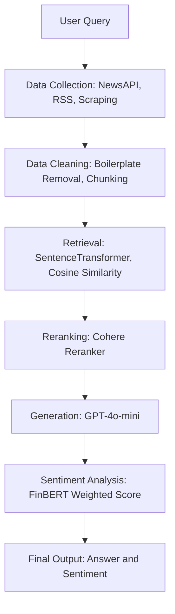

# GenAI RAG Pipeline with Sentiment Analysis

## Project Overview
This project implements a query-driven financial news Retrieval-Augmented Generation (RAG) system. The goal is to provide concise, relevant, and sentiment-aware answers to user queries using real-time financial news data.

The system collects news from multiple sources, processes and retrieves the most relevant content, and generates natural language responses using a large language model. In addition, it applies domain-specific sentiment analysis (FinBERT) to quantify market sentiment. This allows users to better understand both the information and the underlying tone of financial news.

---

## Architecture Diagram



---

## Pipeline Structure

### 1. Preprocessing (`clean_preprocessing.py`)
- Fetch news data (NewsAPI)
- Clean and filter articles
- Chunk text into smaller pieces
- Output:
  - `df_news`
  - `df_chunks`
  - metadata

---

### 2. RAG Pipeline (`rag_pipeline.py`)
- Convert dataframe → articles
- Index articles into vector store
- Retrieve relevant content
- Generate answer using LLM
- Perform sentiment analysis

---

### 3. Full Pipeline Example

```python
from clean_preprocessing import run_preprocessing
from rag_pipeline import (
    dataframe_to_articles,
    index_articles,
    rag_query_with_sentiment
)

# Step 1: preprocessing
outputs = run_preprocessing(
    question="What is happening with Meta lately?",
    ticker="META",
    include_edgar=False
)

df_news = outputs["df_news"]

# Step 2: convert
articles = dataframe_to_articles(df_news)

# Step 3: index
index_articles(articles)

# Step 4: query
result = rag_query_with_sentiment(
    "What is happening with Meta lately?"
)

print(result)
```
---

## Setup and Execution Instructions

To run the project locally, users should first clone the repository from GitHub and navigate into the project directory. After that, all required dependencies can be installed using the provided requirements file. The system relies on several external APIs, so users need to configure their API keys before execution. Specifically, the OpenAI API key, NewsAPI key, and Cohere API key should be added to the `config/settings.py` file. Once the environment is properly configured, the pipeline can be executed by running the main script, which will trigger the full workflow from data collection to final response generation.

---

## Implemented Features vs. Planned Features

The current system successfully implements an end-to-end Retrieval-Augmented Generation pipeline. It integrates multiple data sources, including NewsAPI, RSS feeds, and web scraping, to collect financial news in real time. The collected data is cleaned and segmented into manageable text chunks before being transformed into embeddings using a SentenceTransformer model. These embeddings enable semantic retrieval through cosine similarity, followed by a reranking step using the Cohere model to improve relevance. The final response is generated using a large language model, and sentiment analysis is applied using FinBERT, with scores weighted by retrieval relevance. In addition, a logging system has been introduced to track the execution of the pipeline and improve transparency during debugging.

Despite these implemented components, several planned features remain under development. The system currently operates entirely in-memory, and future improvements include integrating a vector database such as FAISS or Pinecone to enhance scalability. Real-time streaming updates for financial news and a frontend interface for user interaction are also planned. Furthermore, the evaluation framework can be extended with more rigorous metrics such as precision, recall, and ranking quality. Improvements in sentiment aggregation and interpretability are also expected, along with potential support for multiple languages.

---

## Known Limitations and Technical Debt

The current implementation prioritizes functionality and rapid prototyping, which introduces several limitations. The in-memory design restricts scalability and may not perform well with large datasets. The sequential nature of API calls can lead to increased latency, especially when multiple external services are involved. In addition, the system relies heavily on third-party APIs, which introduces potential instability and dependency risks.

From a software engineering perspective, error handling and retry mechanisms are still limited, which may affect robustness in real-world scenarios. The sentiment aggregation approach is relatively simple and may not fully capture the complexity of financial language and context. Moreover, the system does not currently implement caching or persistence, which leads to redundant computations for repeated queries.

These limitations reflect deliberate trade-offs made during development, where the primary focus was on demonstrating the core technical workflow and validating the feasibility of the approach.
